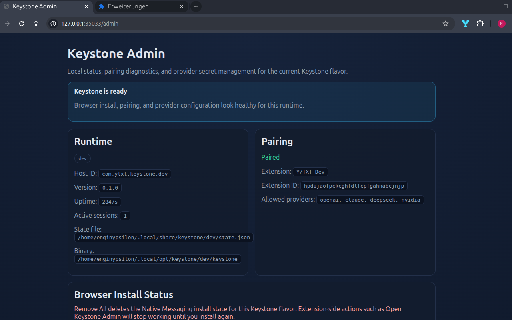
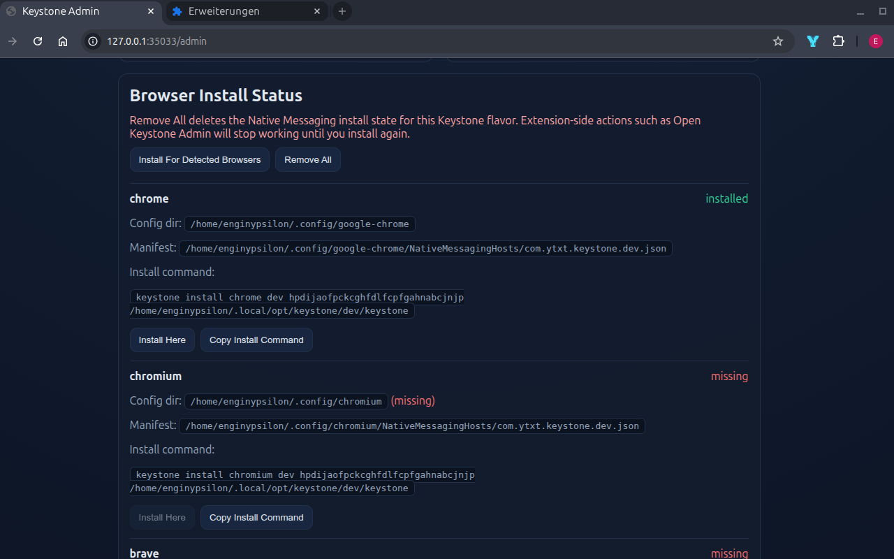
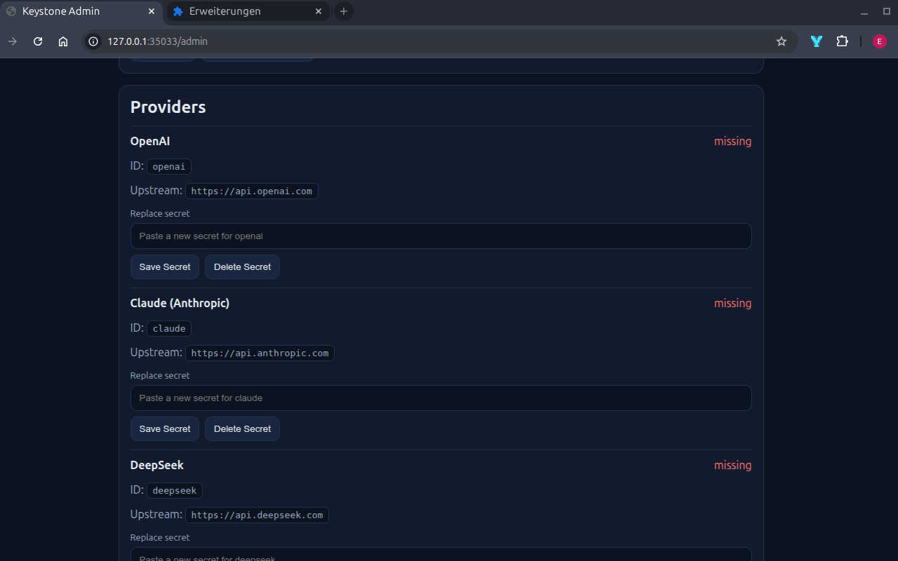

# Keystone

Your local key host for secure connections in insecure browser terrain.

This repository currently contains:

- the canonical concept: [CONCEPT.keystone.latest.md](./CONCEPT.keystone.latest.md)
- the v1 protocol: [PROTOCOL.md](./PROTOCOL.md)
- a working Rust native host in `src/`
- a local admin UI served from Keystone itself at `/admin`

Release artifacts for tagged versions are published through GitHub Actions.

## Screenshots

Admin overview:



Browser install status:



Provider secret management:



## Current Status

Implemented now:

- Native Messaging framing and request dispatch
- Pairing persistence per flavor
- OS keyring-backed secret storage
- Localhost provider tunnel for supported upstream APIs
- Native-host installer script for Linux Chromium-family browsers
- Local admin UI and JSON status endpoints at `/admin` and `/admin/api/status`

Still missing for a real release:

- local approval UI for first pairing / secret replacement
- polished per-OS installer flow for macOS and Windows
- packaging, signing, and release automation
- broader UX around first-run setup and upgrades

## Support Matrix

Keystone is not browser-scoped at the secret-storage level, but Native Messaging installation is browser-scoped.

That means:

- secrets live in Keystone's own local storage and OS keyring, outside the browser
- pairing and trust are separated by flavor (`dev`, `beta`, `prod`) and extension ID
- each browser still needs its own Native Messaging manifest installed before it can launch Keystone

Current support:

- Linux + Chrome: supported
- Linux + Chromium: supported
- Linux + Brave: supported
- Linux + Opera: supported
- Linux + Vivaldi: supported
- macOS: not implemented yet
- Windows: not implemented yet

So support in one browser does not automatically imply support in another browser, even though the underlying Keystone state can be reused once both are installed.

## Run

If Rust is installed:

```bash
cargo run
```

The binary reads Chrome Native Messaging messages from `stdin` and writes JSON responses to `stdout`.

For standalone local admin mode without Chrome Native Messaging:

```bash
cargo run --bin keystone -- serve
```

This starts Keystone's localhost HTTP server, prints the admin URL, and keeps running until `Ctrl+C`.

## Packaging

The first release target is downloadable GitHub Release artifacts, not source-build-only usage.

Packaging scope and release-shape planning live in [PACKAGING.md](/home/enginypsilon/bin/ai/keystone/PACKAGING.md).

The short version:

- Linux, macOS, and Windows release binaries
- checksums for every artifact
- same `keystone` CLI on every OS
- browser integration still handled by `keystone install ...` or the admin UI

## Main CLI

The main `keystone` binary now exposes the first release-facing local commands:

```bash
cargo run --bin keystone -- status
cargo run --bin keystone -- status --json
cargo run --bin keystone -- detect
cargo run --bin keystone -- install chrome dev your_extension_id /absolute/path/to/keystone
cargo run --bin keystone -- serve
```

Current intent:

- `status`: report flavor, pairing, provider secret state, wrapper path, and installed browser manifests
- `status --json`: same status as machine-readable JSON for future installers and tooling
- `detect`: list supported detected Chromium-family browser Native Messaging directories
- `install`: install the Native Messaging manifest and flavor wrapper for one browser or `all`
- `serve`: run Keystone as a standalone localhost admin/server process

## Build Flavors

Keystone treats `dev`, `beta`, and `prod` as separate trust domains.

Set the flavor with:

```bash
KEYSTONE_FLAVOR=dev cargo run
KEYSTONE_FLAVOR=beta cargo run
KEYSTONE_FLAVOR=prod cargo run
```

Defaults:

- flavor defaults to `prod`
- keyring service name follows the host identity for that flavor
- pairing state is persisted locally per flavor in the user data directory

## Extension Identity Input

In real Chrome Native Messaging runs, Chrome passes the caller origin as the first process argument, typically:

```text
chrome-extension://<extension-id>/
```

Keystone reads that at startup and uses it as the runtime extension identity.

For dev/testing only, you can override it manually:

```bash
KEYSTONE_EXTENSION_ID_OVERRIDE=yourdevextensionid cargo run
```

This override should not be used for production packaging.

## Dev Harness

Keystone includes a small helper binary for generating Native Messaging request payloads and checking runtime flavor/identity setup.

Examples:

```bash
cargo run --bin keystone-dev -- runtime-info
cargo run --bin keystone-dev -- hello
cargo run --bin keystone-dev -- pair openai
cargo run --bin keystone-dev -- set-secret openai sk-...
cargo run --bin keystone-dev -- open-session openai
cargo run --bin keystone-dev -- manifest dev /absolute/path/to/keystone yourdevextensionid
cargo run --bin keystone-dev -- smoke
cargo run --bin keystone-dev -- smoke-persist
```

This helper does not talk to Chrome directly. It is a compact way to generate and inspect the request payloads Keystone expects.

`smoke` is the first real local end-to-end path:

- spawns Keystone in `dev` flavor
- forces the in-memory vault
- performs framed Native Messaging calls
- opens a session
- calls authenticated `/health`

It does not store real secrets or call a real provider.

`smoke-persist` runs the flow once, restarts the host, and checks whether `bridge.hello` reports the extension as already paired.

## Local Admin UI

Keystone exposes a localhost admin page from the same ephemeral HTTP server it uses for authenticated provider tunneling.

Current admin routes:

- `/admin`
- `/admin/api/status`
- `POST /admin/api/install`
- `POST /admin/api/install/{browser}`
- `DELETE /admin/api/install`
- `POST /admin/api/secrets`
- `DELETE /admin/api/secrets/{provider}`

The easiest way to reach it from an extension is via Native Messaging:

- call `bridge.open_settings`
- read the returned `url`
- open that URL in a browser tab

`bridge.status` now also includes `admin_ui_url`.

For direct local use without the extension keeping a Native Messaging port open:

- run `cargo run --bin keystone -- serve`
- open the printed `/admin` URL in a browser

## Linux Chromium-Browser Install

Detect supported installed Chromium-family browsers:

```bash
cargo run --bin keystone -- detect
```

Current Linux support:

- Chrome
- Chromium
- Brave
- Opera
- Vivaldi

Install for one browser explicitly:

```bash
cargo run --bin keystone -- install chrome dev yourdevextensionid /absolute/path/to/target/debug/keystone
```

Install for all detected supported browsers:

```bash
cargo run --bin keystone -- install all dev yourdevextensionid /absolute/path/to/target/debug/keystone
```

This does not silently install everywhere by default. `all` is explicit.

## Linux Release Install

The Linux GitHub Release archive now includes a small helper script for the common end-user path:

```bash
./install-keystone-linux.sh <browser|all> <dev|beta|prod> <extension-id>
```

Example:

```bash
./install-keystone-linux.sh chrome prod your_extension_id
```

What it does:

- copies the released `keystone` binary into `~/.local/opt/keystone/<flavor>/keystone`
- makes it executable
- runs `keystone install ...` against that stable installed path

After that:

1. reload the Y/TXT extension
2. open Y/TXT Options
3. click `Test Keystone Connection`

## Chrome Web Store Submission Notes

If Y/TXT is submitted to the Chrome Web Store, the reviewer-facing justification should be based on the current implementation, not the older design drafts.

Suggested submission text:

### `nativeMessaging`

> Y/TXT uses Chrome Native Messaging to communicate with an optional local companion app called Keystone (https://github.com/yaijs/keystone). Keystone stores provider API keys outside the extension using the operating system's local secret storage mechanisms. Keystone is optional. If the reviewer does not wish to install Keystone, the extension still works using local extension-managed API key storage configured in the options page.

### `http://127.0.0.1/*`

> Y/TXT uses an ephemeral localhost HTTP endpoint exposed by the optional Keystone companion app. This is required so the extension can receive streamed AI responses from Keystone over loopback after a session is opened through Native Messaging. The localhost endpoint is bound to 127.0.0.1 only, uses a random ephemeral port, and requires short-lived session tokens generated over the Native Messaging bridge. The extension does not scan arbitrary local ports.

### `scripting`

> Y/TXT uses the scripting permission only to read the user's currently selected text from the active tab when the user opens the popup and runs a tool. It does not use eval(), Function(), remote code loading, or arbitrary script execution from AI output. The returned model output is treated as text, not executable code.

### Reviewer Notes

> Keystone is an optional security enhancement, not a hard dependency for basic testing. If Keystone is not installed, Y/TXT falls back to extension-managed provider keys configured through the options page. This allows reviewers to test the extension without installing the companion app, while still documenting the stronger local-vault option for users who want it.
